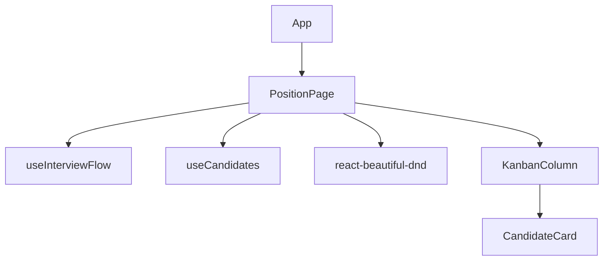

# Página `Position`

La página `Position` muestra y gestiona candidatos en un tablero Kanban. Está diseñada para ser responsiva y permite mover candidatos entre fases utilizando drag & drop.

## **Estructura de componentes**

## **Endpoints utilizados**

1. **`GET /positions/:id/interviewFlow`**
   - Obtiene las fases del proceso de entrevistas para una posición.

2. **`GET /positions/:id/candidates`**
   - Obtiene la lista de candidatos asociados a una posición.

3. **`PUT /candidates/:id/stage`**
   - Actualiza la fase de un candidato al moverlo entre columnas.

## **Características principales**

- **Kanban dinámico**: Las columnas se generan dinámicamente según las fases obtenidas del endpoint.
- **Drag & Drop**: Implementado con `react-beautiful-dnd`.
- **Optimistic UI**: Actualiza el estado local inmediatamente al mover un candidato.
- **Responsivo**: Compatible con dispositivos móviles.

## **Pruebas**

- **Unitarias**: Validan los hooks y componentes principales.
- **Integración**: Simulan los endpoints utilizando MSW.
- **E2E**: Validan el flujo completo del Kanban.

---

**Autor:** Equipo de desarrollo de LTI (ATS)
