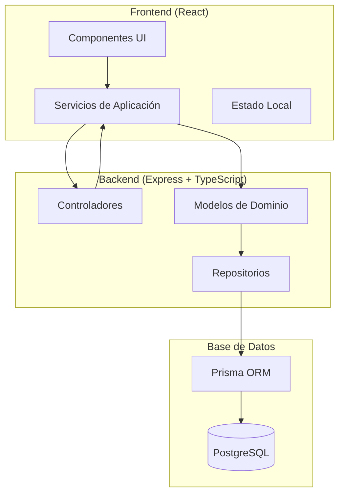
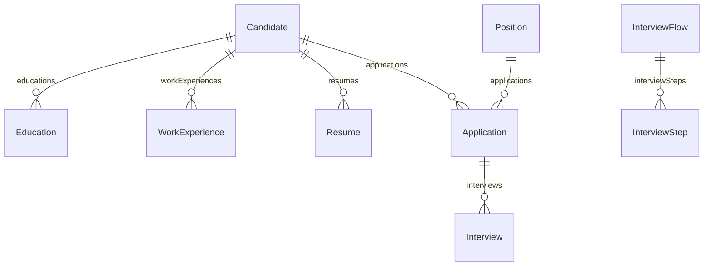

# Patrones del Sistema - LTI Talent Tracking System

## Arquitectura General

El sistema LTI sigue una arquitectura **Domain-Driven Design (DDD)** con separación clara de responsabilidades y patrones bien definidos.



## Patrones de Diseño Implementados

### 1. Domain-Driven Design (DDD)

#### Capas de la Arquitectura

**Domain Layer** (`backend/src/domain/`)
- Contiene la lógica de negocio pura
- Modelos de dominio con comportamiento
- Reglas de negocio encapsuladas

**Application Layer** (`backend/src/application/`)
- Orquesta los casos de uso
- Coordina entre diferentes servicios de dominio
- No contiene lógica de negocio

**Presentation Layer** (`backend/src/presentation/`)
- Controladores REST
- Manejo de requests/responses
- Validación de entrada

**Infrastructure Layer** (implícita)
- Prisma como ORM
- Configuración de base de datos
- Servicios externos

#### Entidades de Dominio

```typescript
// Ejemplo: Candidate como entidad de dominio
export class Candidate {
    id?: number;
    firstName: string;
    lastName: string;
    email: string;
    educations: Education[];
    workExperiences: WorkExperience[];
    
    constructor(data: any) {
        this.id = data.id;
        this.firstName = data.firstName;
        this.lastName = data.lastName;
        this.email = data.email;
        this.educations = data.educations?.map(edu => new Education(edu)) || [];
        this.workExperiences = data.workExperiences?.map(exp => new WorkExperience(exp)) || [];
    }
    
    // Métodos de dominio
    validateEmail(): boolean {
        return this.email.includes('@');
    }
    
    getFullName(): string {
        return `${this.firstName} ${this.lastName}`;
    }
}
```

### 2. Repository Pattern

Los repositorios encapsulan la lógica de acceso a datos:

```typescript
// Patrón implementado en servicios
export class CandidateService {
    static async addCandidate(candidateData: any): Promise<Candidate> {
        // Lógica de negocio
        const candidate = new Candidate(candidateData);
        
        // Acceso a datos a través de Prisma
        const savedCandidate = await prisma.candidate.create({
            data: {
                firstName: candidate.firstName,
                lastName: candidate.lastName,
                email: candidate.email,
                // ... otros campos
            }
        });
        
        return new Candidate(savedCandidate);
    }
}
```

### 3. Service Layer Pattern

Los servicios orquestan operaciones complejas:

```typescript
// Ejemplo de servicio que coordina múltiples entidades
export class CandidateService {
    static async addCandidateWithDetails(candidateData: any): Promise<Candidate> {
        // 1. Crear candidato
        const candidate = await this.addCandidate(candidateData);
        
        // 2. Agregar educación
        if (candidateData.educations) {
            for (const edu of candidateData.educations) {
                await this.addEducation(candidate.id!, edu);
            }
        }
        
        // 3. Agregar experiencia laboral
        if (candidateData.workExperiences) {
            for (const exp of candidateData.workExperiences) {
                await this.addWorkExperience(candidate.id!, exp);
            }
        }
        
        return candidate;
    }
}
```

### 4. Controller Pattern

Los controladores manejan las requests HTTP:

```typescript
// Patrón implementado en controladores
export class CandidateController {
    static async createCandidate(req: Request, res: Response) {
        try {
            const candidate = await CandidateService.addCandidateWithDetails(req.body);
            res.status(201).json(candidate);
        } catch (error) {
            res.status(400).json({ error: error.message });
        }
    }
}
```

## Patrones de Base de Datos

### 1. Relaciones Normalizadas



### 2. Migraciones Incrementales

- Uso de Prisma Migrate para cambios de esquema
- Migraciones versionadas y reversibles
- Seed data para desarrollo

## Patrones Frontend

### 1. Component-Based Architecture

```typescript
// Componentes funcionales con hooks
const AddCandidateForm = () => {
    const [formData, setFormData] = useState({});
    const [loading, setLoading] = useState(false);
    
    const handleSubmit = async (e) => {
        e.preventDefault();
        setLoading(true);
        try {
            await candidateService.createCandidate(formData);
            // Manejo de éxito
        } catch (error) {
            // Manejo de error
        } finally {
            setLoading(false);
        }
    };
    
    return (
        <form onSubmit={handleSubmit}>
            {/* Formulario */}
        </form>
    );
};
```

### 2. Service Layer Pattern

```typescript
// Servicios para comunicación con API
export class CandidateService {
    static async createCandidate(candidateData) {
        const response = await fetch('/api/candidates', {
            method: 'POST',
            headers: {
                'Content-Type': 'application/json',
            },
            body: JSON.stringify(candidateData),
        });
        
        if (!response.ok) {
            throw new Error('Error creating candidate');
        }
        
        return response.json();
    }
}
```

## Patrones de Testing

### 1. Unit Testing

```typescript
// Testing de servicios con Jest
describe('CandidateService', () => {
    test('should create candidate with valid data', async () => {
        const candidateData = {
            firstName: 'John',
            lastName: 'Doe',
            email: 'john@example.com'
        };
        
        const result = await CandidateService.addCandidate(candidateData);
        expect(result.firstName).toBe('John');
    });
});
```

### 2. Integration Testing

```typescript
// Testing de controladores
describe('CandidateController', () => {
    test('POST /candidates should create candidate', async () => {
        const response = await request(app)
            .post('/candidates')
            .send({
                firstName: 'John',
                lastName: 'Doe',
                email: 'john@example.com'
            });
        
        expect(response.status).toBe(201);
        expect(response.body.firstName).toBe('John');
    });
});
```

## Patrones de Configuración

### 1. Environment-Based Configuration

```typescript
// Configuración basada en entorno
const config = {
    database: {
        url: process.env.DATABASE_URL || 'postgresql://localhost:5432/lti'
    },
    server: {
        port: process.env.PORT || 3010
    }
};
```

### 2. Dependency Injection (Parcial)

```typescript
// Inyección de dependencias básica
export class CandidateService {
    constructor(private prismaClient: PrismaClient) {}
    
    async findById(id: number) {
        return this.prismaClient.candidate.findUnique({ where: { id } });
    }
}
```

## Patrones de Manejo de Errores

### 1. Centralized Error Handling

```typescript
// Middleware de manejo de errores
app.use((error: Error, req: Request, res: Response, next: NextFunction) => {
    console.error(error);
    res.status(500).json({
        error: 'Internal Server Error',
        message: error.message
    });
});
```

### 2. Validation Pattern

```typescript
// Validación en capa de aplicación
export class Validator {
    static validateCandidate(data: any): boolean {
        if (!data.email || !data.email.includes('@')) {
            throw new Error('Invalid email');
        }
        return true;
    }
}
```

## Patrones de Documentación

### 1. API Documentation (Swagger)

```yaml
# Documentación automática con Swagger
openapi: 3.0.0
info:
  title: LTI API
  version: 1.0.0
paths:
  /candidates:
    post:
      summary: Create a new candidate
      requestBody:
        required: true
        content:
          application/json:
            schema:
              $ref: '#/components/schemas/Candidate'
```

### 2. Code Documentation

```typescript
/**
 * Servicio para gestionar candidatos
 * Implementa la lógica de negocio relacionada con candidatos
 */
export class CandidateService {
    /**
     * Crea un nuevo candidato con toda su información
     * @param candidateData - Datos del candidato
     * @returns Promise<Candidate> - Candidato creado
     */
    static async addCandidate(candidateData: any): Promise<Candidate> {
        // Implementación
    }
}
```

## Mejoras Propuestas

### 1. Implementar Factory Pattern

```typescript
// Factory para creación de entidades
export class CandidateFactory {
    static createCandidate(data: any): Candidate {
        return new Candidate(data);
    }
    
    static createEducation(data: any): Education {
        return new Education(data);
    }
}
```

### 2. Implementar Event-Driven Architecture

```typescript
// Eventos de dominio
export class CandidateCreatedEvent {
    constructor(public candidate: Candidate) {}
}

// Event handlers
export class CandidateEventHandler {
    static handleCandidateCreated(event: CandidateCreatedEvent) {
        // Lógica de negocio adicional
    }
}
```

### 3. Implementar CQRS Pattern

```typescript
// Separación de comandos y consultas
export class CreateCandidateCommand {
    constructor(public candidateData: any) {}
}

export class GetCandidateQuery {
    constructor(public candidateId: number) {}
}
```
